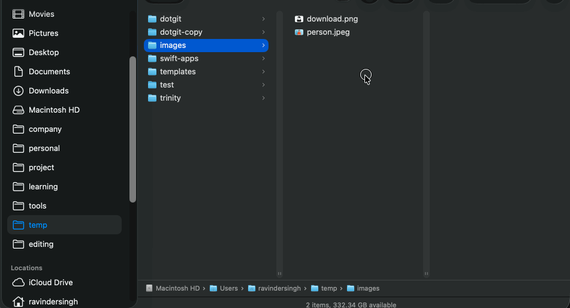

# DropShelf

DropShelf is a macOS utility application built with Swift and SwiftUI that makes file management a breeze. Similar to Dropover, it allows you to easily stash, manage, and move files around your system using a convenient "Shelf".

	

## Features

- **Shake to Open:** Quickly access the drop shelf by simply shaking your mouse cursor. No need to click or remember complex keyboard shortcuts.
- **Menu Bar Accessory:** Runs quietly in the background as a menu bar app (`NSApp.setActivationPolicy(.accessory)`).
- **Drag & Drop:** Easily drag files into the shelf from anywhere on your Mac, and drag them out when you need them.
- **File Previews:** View thumbnails and previews of the files you have stored in the shelf.

## Prerequisites

- macOS 13.0 or later (Recommended)
- Xcode 15.0 or later to build and run the project

## Setup & Installation

1. Clone or download the repository to your local machine.
2. Open the `DropShelf.xcodeproj` file in Xcode.
3. Select your Mac as the active scheme/destination.
4. Build and run the project by pressing `Cmd + R` or clicking the "Play" button in Xcode.

## Usage

1. Launch the app. You will see its icon in your menu bar.
2. To open a shelf, just shake your mouse cursor side-to-side.
3. Drag any files or folders into the transparent shelf window that appears.
4. Drag files out of the shelf to drop them into other apps, folders, or emails.
5. To quit the application, click the DropShelf icon in your menu bar and select "Quit".

## Project Structure

- **DropShelfApp.swift:** The main entry point and menu bar setup.
- **core/**: Contains core utilities like the `ShakeDetector` for cursor movement tracking and `WindowManager`.
- **Features/Shelf/**: Contains the SwiftUI views (`ShelfView`, `FilePreviewCell`, `MultiDragView`) and view models managing the visual presentation of the shelf.

## Contributing

Feel free to open issues or submit pull requests if you have ideas for improvements or new features!
